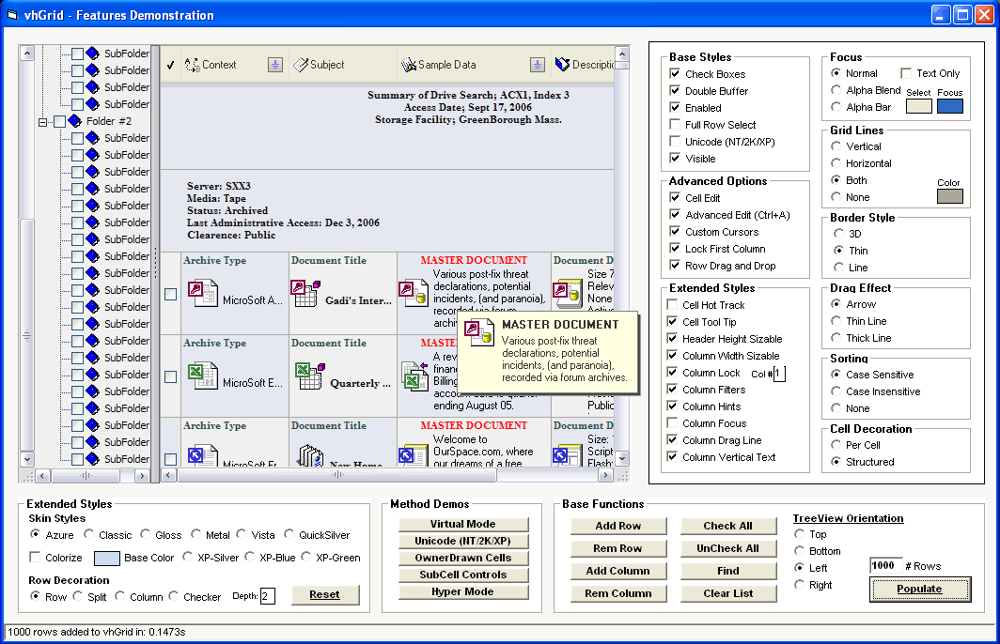

## Final \- vhGrid\!  \- 1\.7  \(Update July 07\)

### Description

v1.7 Is Up!

The uber~grid..

Skinnable headers/scrollbars/checkboxes, integrated treeview, 16 integrated api edit controls, virtual mode, unbound data mode, 32b alpha icon support, sizeable header height, ole drag and drop, full unicode support, column filters, subcell controls, cell tooltips, column tips, custom cursors, ownerdrawn cells..

Hundreds of functions and properties, 27 thousand lines of code..

Dig in, have fun..
 
### More Info
 

             |
---                |---
**Submitted On**   |2007-07-07 18:13:28
**By**             |[Steppenwolfe](https://github.com/Planet-Source-Code/PSCIndex/blob/master/ByAuthor/steppenwolfe.md)
**Level**          |Intermediate
**User Rating**    |5.0 (399 globes from 80 users)
**Compatibility**  |VB 6\.0
**Category**       |[Complete Applications](https://github.com/Planet-Source-Code/PSCIndex/blob/master/ByCategory/complete-applications__1-27.md)
**World**          |[Visual Basic](https://github.com/Planet-Source-Code/PSCIndex/blob/master/ByWorld/visual-basic.md)
**Archive File**   |[Final\_\-\_vh207433772007\.zip](https://github.com/Planet-Source-Code/steppenwolfe-final-vhgrid-1-7-update-july-07__1-67906/archive/master.zip)

